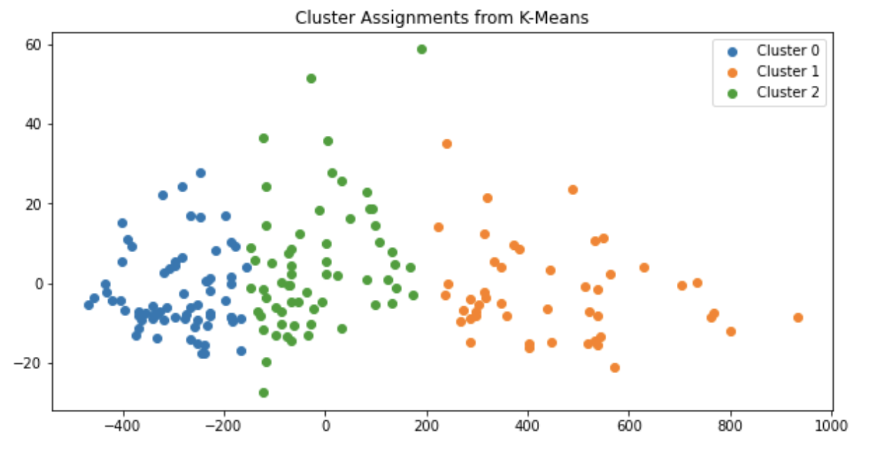

# kmeans_from_scratch

In this project, I implement a K-Means Algorithm from scratch and test it on different datasets.

# [Wine Customer Segmentation](https://github.com/kaykaym01/kmeans_from_scratch/blob/main/Wine%20Customer%20Segementation.ipynb)
After using K-Means to segment the data, running PCA to visualize the clusters and then comparing with labeled customer segments:

